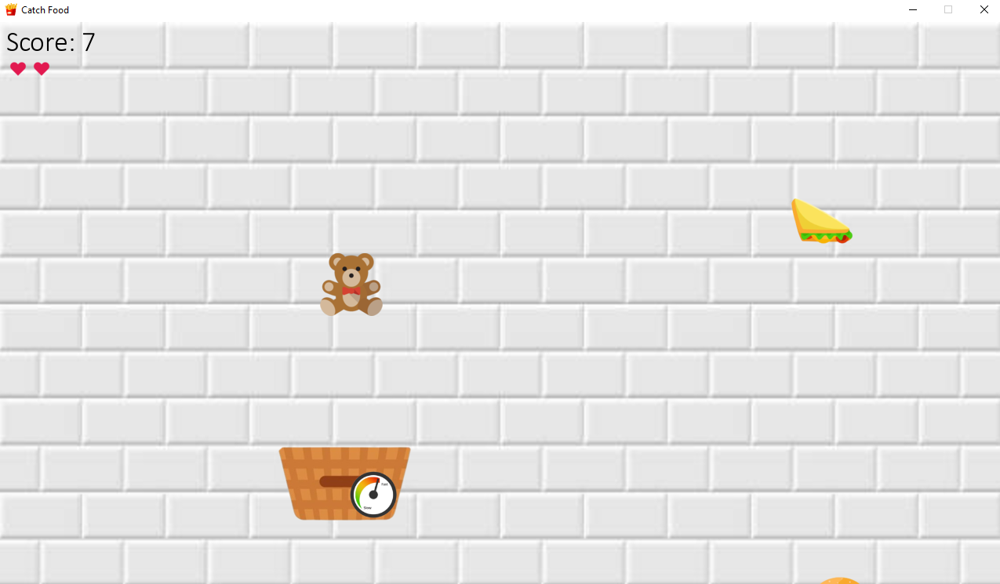

# Catch Food - PyGame 

## Description
 
* This project is an implementation of a game based on the `PyGame` library. 
* The goal of the game is to collect as much falling food as possible by moving a wicker basket using the arrow keys on the keyboard. 
* By entering your name in the menu, your best score will be saved for the future in JSON file. 

Game rules
---
* At the beginning, you start with 3 hearts. Losing all of them results in losing the game.
* You lose hearts by catching falling items **that are not food** (you should avoid them).
* Bonuses appear randomly, providing speed boosts for your basket.
* The speed and frequency of falling items increase over time.

How the game looks like:
---

* **Menu**

* **Gameplay**

